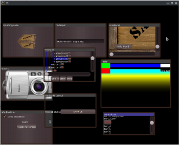

# morda   

OpenGL based GUI library in C++

**morda** is a cross-platform OpenGL based intrusive GUI framework dedicated to games and multimedia applications. Its design was inspired by GUI system from Android and many concepts are borrowed from there. Application using **morda** will have only one native window created for it and OpenGL initialized.

## Why intrusive?
Desicion in favor of intrusive approach was made in order to transparently support non-traditional application lifetime concepts like it is on Android and iOS.

## Why OpenGL?
The intention was to create a truly cross-platform GUI framework, i.e. there should be no any modifications needed to application code in order to build it for different platforms. Only OpenGL out of modern graphics libraries is cross-platofrm and exists on all major platforms.

OpenGL versions supported:
  * OpenGL 2.0 and higher
  * OpenGL ES 2.0 and higher

## Supported platforms
  * Linux
  * Windows
  * MacOS X
  * Android 2.3+ **planned** (draft implementation exists, currently broken)
  * iOS **planned** (draft implementation exists)

# Useful info
  link:wiki/Contribution.adoc[Contributing instructions]
